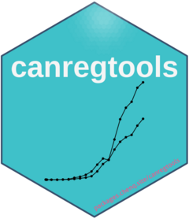

<!-- README.md is generated from README.Rmd. Please edit that file -->

# canregtools 

<!-- badges: start -->

[](https://app.codecov.io/gh/gigu003/canregtools?branch=main)
[](https://github.com/gigu003/canregtools/actions/workflows/R-CMD-check.yaml)
[](https://lifecycle.r-lib.org/articles/stages.html#experimental)
<!-- badges: end -->

canregtools包的主要目的是为肿瘤登记工作者提供数据核查、数据准备、数据分析和可视化常用的功能和函数，包括icd10编码分类功能(classify_icd10)、记录逻辑核查功能(check)等，目前只实现了classify_icd10这个功能，后续将尽快更新。

## 安装

目前这个包还没有放到CRAN上，但是可以通过[GitHub](https://github.com/)来安装开发版本的canregtools，具体方法如下：

``` r
## 安装devtools包
install.packages("devtools")

## 利用devtools包安装存放在github上的canregtools
devtools::install_github("gigu003/canregtools")
```

## 例子

目前该canregtools包实现了如下功能:

- classify_icd10
  该函数把人群肿瘤登记数据的icd10编码转化为肿瘤分类的因子。

``` r
## 加载canregtools包
library(canregtools)
icd10 <- c("C15.1", "C16.0", "C33.4", "D32", "C22.0")
## 按照默认选项把icd10编码转化为癌症分类
classify_icd10(icd10, type = "big", lang = "cn")
#> [1] 食管 胃   肺   脑   肝  
#> 26 Levels: 口腔 鼻咽 食管 胃 结直肠 肝 胆囊 胰腺 喉 肺 其他胸腔器官 ... 其他

## 把icd10编码转化为59分类，并用英语显示
classify_icd10(icd10, type = "small", lang = "en")
#> [1] Esophagus                Stomach                  Trachea, bronchus & lung
#> [4] Brain,nervous system     Liver                   
#> 59 Levels: Lip Tongue Mouth Salivary glands Tonsil ... Other and unspecified
```

## 待实现功能

- 标准化率，包括标准化发病率、死亡率、死亡发病比、病理诊断比例
- 统计报告
- 人口金字塔图
- 质量控制报告
